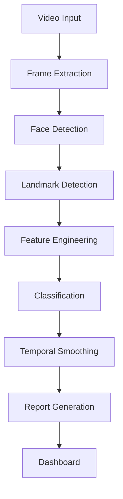
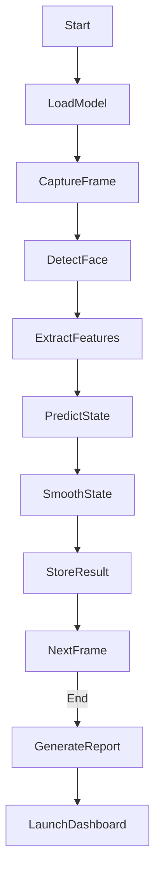
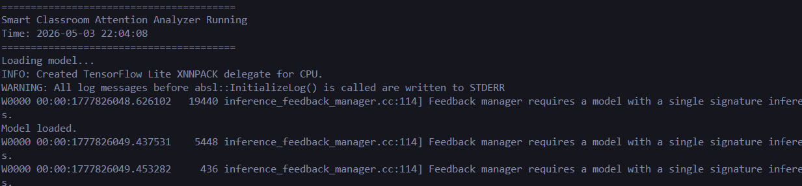
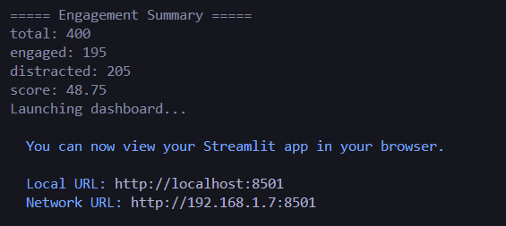
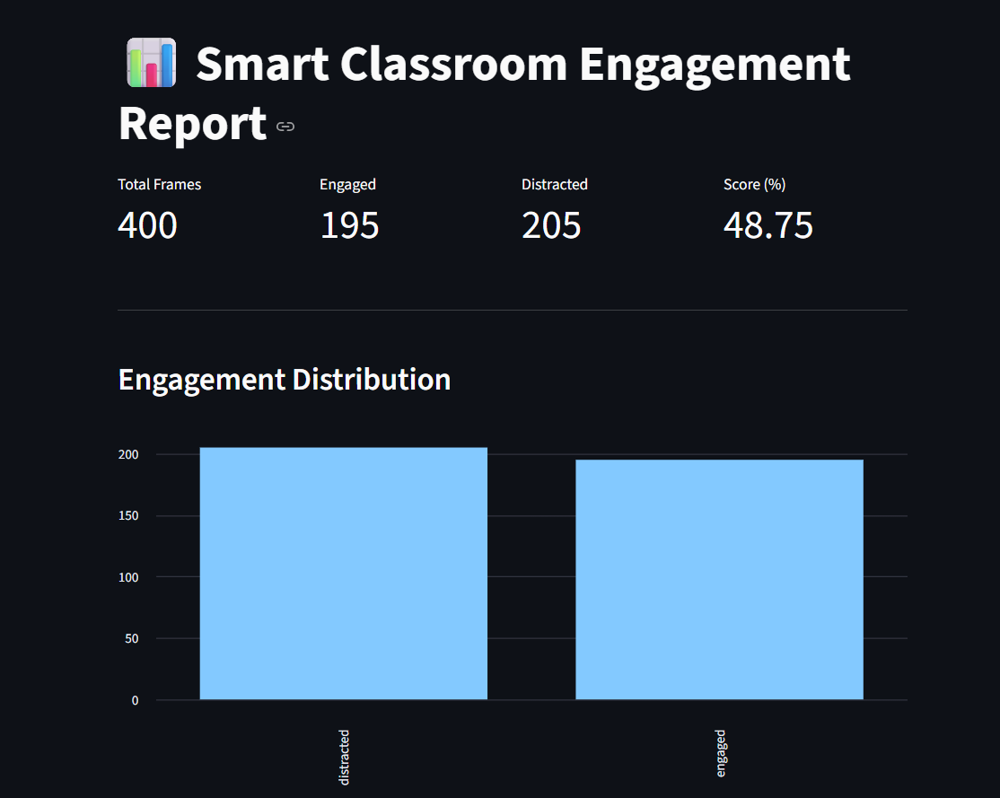
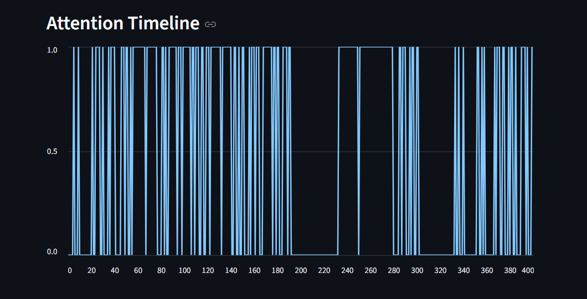

# 🧠 AI-Based Smart Classroom Attention Analyzer

> Real-time student engagement analysis using Computer Vision + Machine Learning

## 🚀 Overview

The **Smart Classroom Attention Analyzer** is an AI-powered system that evaluates student engagement by analyzing facial behavior from live video or recorded classroom footage.

It detects:

* 👁️ Eye closure (fatigue/sleep)
* 🧠 Head orientation (attention direction)
* 😴 Yawning (tiredness)

and classifies students as:

```
Engaged ✅ | Distracted ❌
```

## 🎯 Key Features

* 🎥 Real-time video processing (Webcam / Video file)
* 🧠 Facial landmark detection (468 points)
* 👁️ Eye Aspect Ratio (EAR) for blink detection
* 🧭 Head pose estimation (looking away detection)
* 😴 Yawn detection using mouth landmarks
* 🤖 Hybrid ML + Rule-based classification
* 🔁 Temporal smoothing (stable predictions)
* 📊 Streamlit dashboard for visualization
* 📁 Automatic report generation (CSV)


## 🏗️ System Architecture



## 🔄 Workflow



## 🧰 Tech Stack

* **Computer Vision:** OpenCV, MediaPipe
* **Machine Learning:** Scikit-learn
* **Data Processing:** Pandas, NumPy
* **Visualization:** Streamlit
* **Language:** Python

## 📂 Project Structure

```
AIML-Lab-Project/
│
├── main.py
│
├── data/
│   ├── raw_videos/
│   └── features/
│
├── models/
│   └── attention_model.pkl
│
├── reports/
│   ├── engagement_report.py
│   ├── report_ui.py
│   └── engagement_states.csv
│
├── src/
│   ├── computer_vision/
│   ├── feature_engineering/
│   ├── ml_model/
│   └── utils/
│
├── requirements.txt
└── README.md
```

## ⚙️ Installation

```bash
# Clone repo
git clone https://github.com/deadshotofficial/ai-classroom-analyser.git

# Navigate
cd attention-analyzer

# Create virtual environment (Python 3.11 recommended)
python -m venv .venv
.venv\Scripts\activate

# Install dependencies
pip install -r requirements.txt
```


## ▶️ Usage

```bash
python main.py
```

* Press **q** to quit video
* Dashboard will automatically open in browser

## 📊 Sample Output

* Engagement Score (%)
* Engaged vs Distracted distribution
* Attention timeline graph

## 🧠 Concepts Used

* Computer Vision (Face + Landmark Detection)
* Deep Learning (via MediaPipe)
* Feature Engineering (EAR, Head Pose, MAR)
* Machine Learning (Random Forest)
* Temporal Smoothing (Buffer + Majority Voting)
* Data Visualization


## ⚠️ Limitations

* Sensitive to lighting conditions
* No individual student tracking
* Limited to binary classification
* Requires proper camera alignment


## 🚀 Future Improvements

* 👤 Multi-student tracking
* 🎯 Gaze direction estimation
* 🔥 Attention heatmap
* 📈 Real-time dashboard updates
* 🧠 Deep learning-based classification
* 📄 PDF report export


## 🧪 Demo

### 🎥 Initialization
<p align="center">
  
</p>

### 📊 Summary Dashboard
<p align="center">
  
</p>

### 📄 Detailed Report Pages

<p align="center">
  
  
</p>

## ⭐ Support

If you like this project:

```
⭐ Star this repo
🍴 Fork it
🚀 Share it
```

## 🤝 Contributing
Contributions are welcome! If you'd like to improve this project:
1. Fork the repository.
2. Create a new branch.
3. Submit a pull request with your changes.


## 💬 Feedback
If you have any suggestions or encounter issues, please feel free to open an [issue](https://github.com/deadshotofficial/ai-classroom-analyser/issues).

## Made with ❤️ by [DeadShot](https://github.com/deadshotofficial) & Team